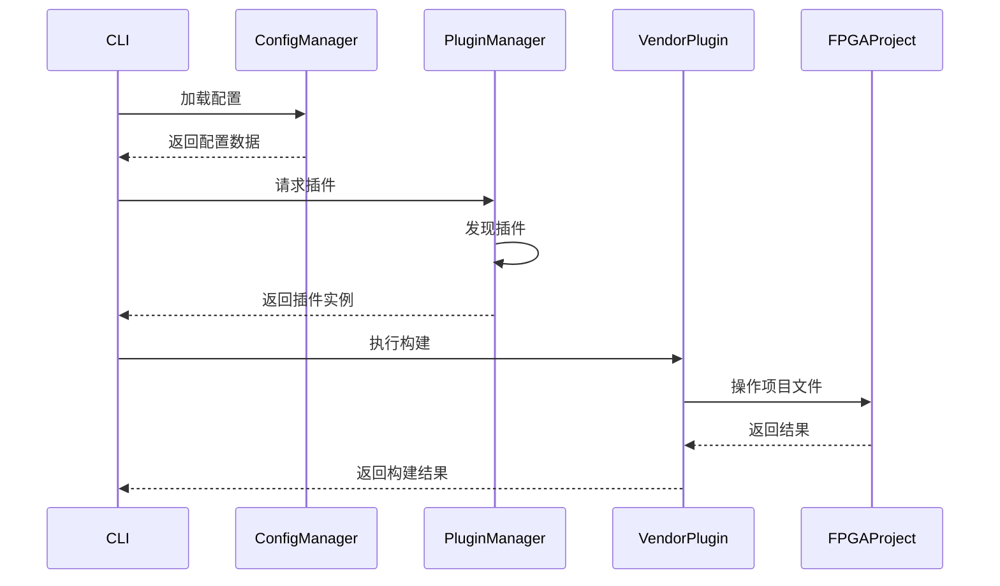

# 架构设计详解

## 设计哲学

FPGABuilder的设计基于以下核心原则：

1. **关注点分离**：配置、插件、执行逻辑各自独立
2. **依赖倒置**：高层模块不依赖低层模块，两者都依赖抽象
3. **开闭原则**：对扩展开放，对修改关闭
4. **接口隔离**：使用专用的小接口而不是通用的大接口

## 系统架构

### 三层架构设计

```
┌─────────────────────────────────┐
│        表示层 (Presentation)    │
│  ┌─────────────────────────┐    │
│  │       CLI / GUI         │    │
│  └─────────────────────────┘    │
└─────────────────────────────────┘
                │
┌─────────────────────────────────┐
│        业务层 (Business)        │
│  ┌─────────────────────────┐    │
│  │   核心框架 (Core)       │    │
│  │  • 配置管理             │    │
│  │  • 项目管理             │    │
│  │  • 插件管理             │    │
│  └─────────────────────────┘    │
└─────────────────────────────────┘
                │
┌─────────────────────────────────┐
│        数据层 (Data)           │
│  ┌─────────────────────────┐    │
│  │    插件系统 (Plugins)   │    │
│  │  • 厂商插件             │    │
│  │  • 工具插件             │    │
│  │  • 扩展插件             │    │
│  └─────────────────────────┘    │
└─────────────────────────────────┘
```

### 核心模块交互



## 配置管理系统

### 配置层次结构

```
全局配置 (global)
    ├── 项目配置 (project)
    │     ├── FPGA配置 (fpga)
    │     ├── 源代码配置 (source)
    │     └── 构建配置 (build)
    └── 用户配置 (user)
          └── 插件配置 (plugins)
```

### 配置解析流程

```python
def load_and_validate_config(config_path):
    # 1. 加载原始配置
    raw_config = load_yaml(config_path)

    # 2. 应用默认值
    config = apply_defaults(raw_config)

    # 3. 验证模式
    validate_schema(config)

    # 4. 解析插件配置
    plugin_configs = extract_plugin_configs(config)

    # 5. 生成完整配置
    final_config = merge_configs(config, plugin_configs)

    return final_config
```

### 配置验证机制

```python
# JSON Schema定义配置结构
CONFIG_SCHEMA = {
    "$schema": "http://json-schema.org/draft-07/schema#",
    "type": "object",
    "properties": {
        "project": {...},
        "fpga": {
            "type": "object",
            "properties": {
                "vendor": {
                    "type": "string",
                    "enum": ["xilinx", "altera", "lattice", "microchip"]
                },
                "part": {"type": "string"},
                ...
            },
            "required": ["vendor", "part"]
        },
        ...
    },
    "required": ["project", "fpga"]
}
```

## 插件系统设计

### 插件发现机制

```
插件发现流程：
1. 扫描插件目录
2. 加载Python模块
3. 识别插件类（继承BasePlugin）
4. 验证插件元数据
5. 注册到插件管理器
```

### 插件生命周期

```python
class PluginLifecycle:
    """插件生命周期管理"""

    def __init__(self, plugin):
        self.plugin = plugin

    def run(self):
        # 1. 初始化
        if not self.plugin.initialize():
            raise PluginInitializationError()

        # 2. 配置验证
        config = self.load_config()
        valid, errors = self.plugin.validate_config(config)
        if not valid:
            raise ConfigValidationError(errors)

        # 3. 执行主要逻辑
        result = self.plugin.execute(config)

        # 4. 清理
        self.plugin.cleanup()

        return result
```

### 插件依赖管理

```python
class PluginDependencyResolver:
    """插件依赖解析器"""

    def resolve(self, plugins):
        # 构建依赖图
        dependency_graph = self.build_dependency_graph(plugins)

        # 拓扑排序
        execution_order = self.topological_sort(dependency_graph)

        # 检查循环依赖
        if self.has_cycle(dependency_graph):
            raise CircularDependencyError()

        return execution_order
```

## 项目管理架构

### 项目模型

```python
@dataclass
class FPGAProject:
    """FPGA项目模型"""

    # 标识信息
    name: str
    version: str
    description: str

    # 技术信息
    fpga_config: FPGAConfig
    source_config: SourceConfig

    # 构建信息
    build_config: BuildConfig
    dependency_config: DependencyConfig

    # 状态信息
    created_at: datetime
    modified_at: datetime
    build_history: List[BuildRecord]
```

### 项目创建流程

```
项目创建流程：
1. 验证输入参数
2. 创建目录结构
3. 生成配置文件
4. 初始化Git仓库（可选）
5. 添加子模块（可选）
6. 创建模板文件
7. 生成文档结构
```

### 项目验证

```python
class ProjectValidator:
    """项目验证器"""

    def validate(self, project):
        errors = []

        # 1. 结构验证
        errors.extend(self.validate_structure(project))

        # 2. 配置验证
        errors.extend(self.validate_config(project))

        # 3. 依赖验证
        errors.extend(self.validate_dependencies(project))

        # 4. 插件验证
        errors.extend(self.validate_plugins(project))

        return errors

    def validate_structure(self, project):
        """验证项目结构"""
        required_dirs = ['src/hdl', 'src/constraints', 'build']
        errors = []

        for dir_path in required_dirs:
            if not os.path.exists(dir_path):
                errors.append(f"缺失目录: {dir_path}")

        return errors
```

## 构建系统架构

### 构建流水线

```
构建流水线：
┌─────────────────┐ ┌─────────────────┐ ┌─────────────────┐
│   预处理阶段    │ │   构建阶段      │ │   后处理阶段    │
│  • 配置解析    │ │  • 综合         │ │  • 报告生成    │
│  • 源文件收集  │ │  • 实现         │ │  • 文档生成    │
│  • 依赖检查    │ │  • 比特流生成   │ │  • 打包发布    │
└─────────────────┘ └─────────────────┘ └─────────────────┘
```

### 构建状态机

```python
class BuildStateMachine:
    """构建状态机"""

    def __init__(self):
        self.state = BuildState.INITIAL

    def transition(self, event):
        """状态转移"""
        transitions = {
            BuildState.INITIAL: {
                BuildEvent.CONFIG_LOADED: BuildState.CONFIGURED
            },
            BuildState.CONFIGURED: {
                BuildEvent.PREPROCESS_COMPLETE: BuildState.PREPROCESSED
            },
            BuildState.PREPROCESSED: {
                BuildEvent.SYNTHESIS_COMPLETE: BuildState.SYNTHESIZED
            },
            # ... 更多状态转移
        }

        if self.state in transitions and event in transitions[self.state]:
            self.state = transitions[self.state][event]
            return True

        return False
```

### 构建结果管理

```python
@dataclass
class BuildResult:
    """构建结果"""

    success: bool
    artifacts: Dict[str, str]  # 输出文件
    logs: Dict[str, str]       # 日志文件
    metrics: Dict[str, Any]    # 构建指标
    warnings: List[str]        # 警告信息
    errors: List[str]          # 错误信息
    duration: float            # 构建时长

    def to_dict(self):
        """转换为字典"""
        return {
            'success': self.success,
            'artifacts': self.artifacts,
            'metrics': self.metrics,
            'duration': self.duration,
            'has_warnings': len(self.warnings) > 0,
            'has_errors': len(self.errors) > 0
        }
```

## 工具链解耦设计

### 抽象接口设计

```python
# 厂商无关的抽象接口
class FPGAVendorPlugin(ABC):
    """FPGA厂商插件抽象基类"""

    @abstractmethod
    def synthesize(self, config):
        """综合 - 所有厂商都必须实现此方法"""
        pass

    @abstractmethod
    def implement(self, config):
        """实现 - 所有厂商都必须实现此方法"""
        pass

    @abstractmethod
    def generate_bitstream(self, config):
        """生成比特流 - 所有厂商都必须实现此方法"""
        pass
```

### 适配器模式应用

```
适配器模式：
┌─────────────────┐     ┌─────────────────┐     ┌─────────────────┐
│   统一接口      │────▶│   适配器        │────▶│   具体实现      │
│  • synthesize() │     │  • VivadoAdapter│     │  • Vivado工具   │
│  • implement()  │     │  • QuartusAdapter│    │  • Quartus工具  │
│  • generate_    │     │                 │     │                 │
│    bitstream()  │     └─────────────────┘     └─────────────────┘
└─────────────────┘
```

### 配置到实现的映射

```python
class ConfigToImplementationMapper:
    """配置到实现映射器"""

    def __init__(self, plugin_manager):
        self.plugin_manager = plugin_manager

    def map_config_to_plugin(self, config):
        """根据配置选择合适的插件"""

        # 1. 获取厂商信息
        vendor = config.get('fpga.vendor')

        # 2. 获取可用插件
        available_plugins = self.plugin_manager.get_vendor_plugins()

        # 3. 匹配插件
        for plugin in available_plugins:
            if plugin.vendor == vendor:
                return plugin

        # 4. 未找到合适插件
        raise NoSuitablePluginError(f"未找到 {vendor} 厂商的插件")

    def map_config_to_actions(self, config, plugin):
        """将配置映射到具体操作"""

        actions = []

        # 根据配置决定执行哪些构建步骤
        if config.get('build.synthesis.enabled', True):
            actions.append(plugin.synthesize)

        if config.get('build.implementation.enabled', True):
            actions.append(plugin.implement)

        if config.get('build.bitstream.enabled', True):
            actions.append(plugin.generate_bitstream)

        return actions
```

## 扩展点设计

### 1. 配置扩展点

```python
# 配置模式扩展
def extend_config_schema(base_schema, extensions):
    """扩展配置模式"""

    extended_schema = deepcopy(base_schema)

    for path, schema_extension in extensions.items():
        # 在指定路径添加扩展
        self._add_schema_extension(extended_schema, path, schema_extension)

    return extended_schema
```

### 2. 插件扩展点

```python
# 插件发现扩展
class ExtendedPluginDiscoverer:
    """扩展的插件发现器"""

    def discover_plugins(self):
        """发现所有插件"""

        plugins = []

        # 1. 内置插件
        plugins.extend(self._discover_builtin_plugins())

        # 2. 用户插件
        plugins.extend(self._discover_user_plugins())

        # 3. 外部插件
        plugins.extend(self._discover_external_plugins())

        return plugins

    def _discover_user_plugins(self):
        """发现用户自定义插件"""

        user_plugin_dirs = [
            Path.home() / '.fpga_builder' / 'plugins',
            Path.cwd() / 'plugins'
        ]

        plugins = []
        for plugin_dir in user_plugin_dirs:
            if plugin_dir.exists():
                plugins.extend(self._discover_plugins_in_dir(plugin_dir))

        return plugins
```

### 3. 构建流程扩展点

```python
# 可扩展的构建流程
class ExtensibleBuildPipeline:
    """可扩展的构建流水线"""

    def __init__(self):
        self.pre_processors = []
        self.build_steps = []
        self.post_processors = []

    def add_pre_processor(self, processor):
        """添加预处理器"""
        self.pre_processors.append(processor)

    def add_build_step(self, step):
        """添加构建步骤"""
        self.build_steps.append(step)

    def add_post_processor(self, processor):
        """添加后处理器"""
        self.post_processors.append(processor)

    def execute(self, config):
        """执行完整构建流程"""

        # 1. 预处理
        for processor in self.pre_processors:
            processor.process(config)

        # 2. 构建
        results = []
        for step in self.build_steps:
            result = step.execute(config)
            results.append(result)

            if not result.success:
                break

        # 3. 后处理
        for processor in self.post_processors:
            processor.process(config, results)

        return results
```

## 性能优化设计

### 1. 缓存策略

```python
class BuildCache:
    """构建缓存"""

    def __init__(self, cache_dir):
        self.cache_dir = Path(cache_dir)
        self.cache_index = {}

    def get_cache_key(self, config, step):
        """生成缓存键"""

        # 基于配置和步骤生成唯一键
        key_data = {
            'config_hash': self._hash_config(config),
            'step': step,
            'source_files': self._get_source_files_hash(config),
            'tool_version': self._get_tool_version()
        }

        return hashlib.md5(json.dumps(key_data).encode()).hexdigest()

    def get_cached_result(self, key):
        """获取缓存结果"""
        if key in self.cache_index:
            cache_file = self.cache_dir / f"{key}.cache"
            if cache_file.exists():
                return self._load_cache(cache_file)

        return None

    def cache_result(self, key, result):
        """缓存结果"""
        cache_file = self.cache_dir / f"{key}.cache"
        self._save_cache(cache_file, result)
        self.cache_index[key] = str(cache_file)
```

### 2. 并行执行

```python
class ParallelExecutor:
    """并行执行器"""

    def execute_parallel(self, tasks, max_workers=None):
        """并行执行任务"""

        if max_workers is None:
            max_workers = os.cpu_count() or 1

        with ThreadPoolExecutor(max_workers=max_workers) as executor:
            # 提交所有任务
            future_to_task = {
                executor.submit(task.execute): task
                for task in tasks
            }

            # 收集结果
            results = []
            for future in as_completed(future_to_task):
                task = future_to_task[future]
                try:
                    result = future.result()
                    results.append((task, result))
                except Exception as e:
                    results.append((task, BuildResult(
                        success=False,
                        errors=[str(e)]
                    )))

        return results
```

### 3. 增量构建

```python
class IncrementalBuilder:
    """增量构建器"""

    def should_rebuild(self, target, dependencies):
        """检查是否需要重新构建"""

        if not target.exists():
            return True

        target_mtime = target.stat().st_mtime

        for dep in dependencies:
            if not dep.exists():
                continue

            dep_mtime = dep.stat().st_mtime
            if dep_mtime > target_mtime:
                return True

        return False

    def build_if_needed(self, target, dependencies, build_func):
        """如果需要则构建"""

        if self.should_rebuild(target, dependencies):
            return build_func()
        else:
            # 使用缓存结果
            return BuildResult(
                success=True,
                artifacts={str(target): "cached"},
                logs={"incremental_build": "使用缓存"}
            )
```

## 错误处理设计

### 1. 错误分类

```python
class ErrorHierarchy:
    """错误层次结构"""

    # 基础错误
    class FPGABuilderError(Exception):
        pass

    # 配置相关错误
    class ConfigError(FPGABuilderError):
        pass

    class ConfigValidationError(ConfigError):
        pass

    class ConfigNotFoundError(ConfigError):
        pass

    # 插件相关错误
    class PluginError(FPGABuilderError):
        pass

    class PluginNotFoundError(PluginError):
        pass

    class PluginInitializationError(PluginError):
        pass

    # 构建相关错误
    class BuildError(FPGABuilderError):
        pass

    class BuildFailedError(BuildError):
        pass

    class ToolchainError(BuildError):
        pass
```

### 2. 错误恢复

```python
class ErrorRecovery:
    """错误恢复机制"""

    def recover_from_error(self, error, context):
        """从错误中恢复"""

        recovery_strategies = {
            ConfigValidationError: self._recover_from_config_error,
            PluginNotFoundError: self._recover_from_plugin_error,
            BuildFailedError: self._recover_from_build_error,
            ToolchainError: self._recover_from_toolchain_error
        }

        error_type = type(error)
        if error_type in recovery_strategies:
            return recovery_strategies[error_type](error, context)
        else:
            return self._recover_from_unknown_error(error, context)

    def _recover_from_config_error(self, error, context):
        """从配置错误恢复"""

        # 尝试使用默认配置
        if 'config' in context:
            context['config'] = self._get_default_config()
            return RecoveryResult(
                success=True,
                action="使用默认配置",
                warning="配置验证失败，使用默认配置继续"
            )

        return RecoveryResult(
            success=False,
            action="无法恢复",
            error="配置错误且无默认配置可用"
        )
```

## 监控与日志

### 1. 结构化日志

```python
class StructuredLogger:
    """结构化日志记录器"""

    def __init__(self):
        self.log_entries = []

    def log_build_start(self, config):
        """记录构建开始"""

        entry = {
            'timestamp': datetime.now().isoformat(),
            'level': 'INFO',
            'event': 'build_start',
            'data': {
                'project': config.get('project.name'),
                'vendor': config.get('fpga.vendor'),
                'part': config.get('fpga.part')
            }
        }

        self.log_entries.append(entry)
        self._write_log(entry)

    def log_build_step(self, step, result):
        """记录构建步骤"""

        entry = {
            'timestamp': datetime.now().isoformat(),
            'level': 'INFO' if result.success else 'ERROR',
            'event': 'build_step',
            'data': {
                'step': step,
                'success': result.success,
                'duration': result.duration,
                'warnings': len(result.warnings),
                'errors': len(result.errors)
            }
        }

        self.log_entries.append(entry)
        self._write_log(entry)
```

### 2. 性能监控

```python
class PerformanceMonitor:
    """性能监控器"""

    def __init__(self):
        self.metrics = defaultdict(list)

    def start_timing(self, operation):
        """开始计时"""
        self.metrics[operation].append({
            'start': time.time(),
            'end': None,
            'duration': None
        })

    def stop_timing(self, operation):
        """结束计时"""
        if operation in self.metrics and self.metrics[operation]:
            last_record = self.metrics[operation][-1]
            if last_record['end'] is None:
                last_record['end'] = time.time()
                last_record['duration'] = last_record['end'] - last_record['start']

    def get_report(self):
        """获取性能报告"""

        report = {
            'total_operations': len(self.metrics),
            'operations': {}
        }

        for operation, timings in self.metrics.items():
            durations = [t['duration'] for t in timings if t['duration'] is not None]

            if durations:
                report['operations'][operation] = {
                    'count': len(durations),
                    'total_time': sum(durations),
                    'average_time': sum(durations) / len(durations),
                    'max_time': max(durations),
                    'min_time': min(durations)
                }

        return report
```

## 总结

FPGABuilder的架构设计体现了现代软件工程的最佳实践：

1. **模块化设计**：各模块职责清晰，易于理解和维护
2. **可扩展架构**：通过插件系统支持无限扩展
3. **配置驱动**：实现工具链与项目的完全解耦
4. **错误恢复**：鲁棒的错误处理和恢复机制
5. **性能优化**：缓存、并行、增量构建等优化策略

这种设计使得FPGABuilder不仅是一个工具链，更是一个可扩展的FPGA开发平台。